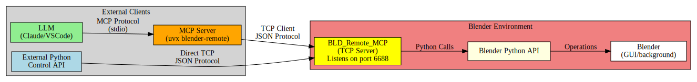

# blender-remote

Control Blender remotely using Python API and LLM through MCP (Model Context Protocol).

**✅ Production Ready** - 97.5% success rate across comprehensive testing with robust error handling and reliable GLB export capabilities.

## Platform Support

**Cross-platform compatibility**: Fully supports Windows, Linux, and macOS
- **Windows**: Native support with automatic Blender path detection
- **Linux**: Native support with automatic Blender path detection
- **macOS**: Native support with automatic Blender path detection
- All features work identically across all platforms

## Key Features

### 1. **Dual Control Interface: Python API + LLM**
Use both Python API and LLM simultaneously to control Blender. The MCP protocol enables LLMs to experiment with Blender operations and help you create new APIs based on their interactions.

```python
# Python API
import blender_remote
client = blender_remote.connect_to_blender(port=6688)
scene_manager = blender_remote.create_scene_manager(client)
# Create objects using direct Blender Python API
client.execute_python('bpy.ops.mesh.primitive_cube_add(location=(2, 0, 0), size=1.5)')
```

```bash
# LLM via MCP
uvx blender-remote  # Start MCP server for Claude, VSCode, Cursor, etc.
```

### 2. **Background Mode Support**
Run Blender completely headless for automation without GUI.

```bash
# GUI mode with auto-start service
export BLD_REMOTE_MCP_START_NOW=1
blender &

# Background mode for automation
blender --background --python start_service.py &
```

### 3. **Flexible Connection Management**
Connect to Blender instances on different hosts and ports with advanced MCP server configuration.

```bash
# Connect to local Blender on custom port
uvx blender-remote --port 7777

# Connect to remote Blender instance
uvx blender-remote --host 192.168.1.100 --port 6688

# Multiple configurations for different projects
uvx blender-remote --host 127.0.0.1 --port 6688  # Development
uvx blender-remote --host 10.0.0.5 --port 6688   # Production
```

### 4. **Command-Line Interface**
Complete CLI tools for setup, configuration, service management, and code execution.

```bash
# Setup and start
blender-remote-cli init [blender_path]
blender-remote-cli install
blender-remote-cli start --scene=assets.blend --log-level=DEBUG

# Execute Python code in Blender
blender-remote-cli execute --code "bpy.ops.mesh.primitive_cube_add()"
blender-remote-cli execute my_script.py --use-base64

# Configuration management
blender-remote-cli config set mcp_service.default_port=7777
blender-remote-cli config get mcp_service.log_level
```

## Installation

```bash
pip install blender-remote
```

## Quick Start

### 1. Install Blender Addon

**Option A: Automated (Recommended)**
```bash
blender-remote-cli init [blender_path]
blender-remote-cli install
```

**Option B: Manual**
```bash
cd blender-remote/blender_addon/
zip -r bld_remote_mcp.zip bld_remote_mcp/
# Install via Blender: Edit > Preferences > Add-ons > Install > Enable "BLD Remote MCP"
```

### 2. Start Blender with Service

```bash
# GUI mode
export BLD_REMOTE_MCP_START_NOW=1
blender &

# Background mode
echo 'import bld_remote; bld_remote.start_mcp_service()' > start_service.py
blender --background --python start_service.py &
```

### 3. Use Python API

```python
import blender_remote

# Connect to Blender
client = blender_remote.connect_to_blender(port=6688)

# High-level scene operations
scene_manager = blender_remote.create_scene_manager(client)
# Create objects using direct Blender Python API
client.execute_python('bpy.ops.mesh.primitive_cube_add(location=(0, 0, 0), size=2.0)')
scene_manager.set_camera_location(location=(7, -7, 5), target=(0, 0, 0))

# Direct code execution
result = client.execute_python("bpy.ops.mesh.primitive_sphere_add()")
```

### 4. Use with LLM

**Configure LLM IDE (VSCode/Claude/Cursor):**
```json
{
  "mcpServers": {
    "blender-remote": {
      "command": "uvx",
      "args": ["blender-remote"]
    }
  }
}
```

**Custom Host/Port Configuration:**
```json
{
  "mcpServers": {
    "blender-remote": {
      "command": "uvx",
      "args": ["blender-remote", "--host", "127.0.0.1", "--port", "6688"]
    }
  }
}
```

**Then ask your LLM:**
- "What objects are in the current Blender scene?"
- "Create a blue metallic cube at position (2, 0, 0)"
- "Export the current scene as GLB"
- "Position the camera for a better view and render the scene"
- "Help me create a new API function for batch object creation"

## Available MCP Tools

| Tool | Description |
|------|-------------|
| `get_scene_info()` | List all objects, materials, and scene properties |
| `get_object_info(name)` | Get detailed object properties |
| `execute_code(code, send_as_base64, return_as_base64)` | Run Python code in Blender context with optional base64 encoding |
| `get_viewport_screenshot()` | Capture viewport image (GUI mode only) |
| `put_persist_data(key, data)` | Store data for later use in the session |
| `get_persist_data(key, default)` | Retrieve stored data by key |
| `remove_persist_data(key)` | Remove stored data |
| `check_connection_status()` | Verify service health |

## Base64 Code Encoding

For complex code with special characters or large blocks, use base64 encoding to prevent formatting issues:

```bash
# CLI with base64 encoding
blender-remote-cli execute complex_script.py --use-base64 --return-base64
```

**When to use base64:**
- Large code blocks with complex formatting
- Code containing special characters or quotes
- When JSON parsing errors occur with complex scripts

## Data Persistence

Store and retrieve data across multiple commands for stateful workflows:

```python
# Inside Blender scripts
import bld_remote
bld_remote.persist.put_data("mesh_analysis", {"vertices": 1540, "faces": 2980})
result = bld_remote.persist.get_data("mesh_analysis")
```

**LLM Example:**
- "Calculate mesh complexity and store the results"
- "Retrieve the previous mesh analysis and create a report"
- "Store this camera position for later use"

Perfect for multi-step operations, caching expensive calculations, and maintaining state between commands.

## How It Works



## Example: LLM-Assisted API Development

1. **LLM experiments**: "Try creating 10 cubes in a grid pattern"
2. **LLM observes**: Uses `execute_code()` to test different approaches
3. **LLM creates API**: "Based on what worked, let me create a `create_cube_grid()` function"
4. **You integrate**: Add the LLM-created function to your Python automation

## CLI Configuration Tool

```bash
# One-time setup
blender-remote-cli init [blender_path]
blender-remote-cli install

# Start Blender service
blender-remote-cli start --background
blender-remote-cli start --scene=my_project.blend --log-level=DEBUG

# Execute Python code
blender-remote-cli execute --code "print('Hello from Blender')"
blender-remote-cli execute script.py --use-base64 --return-base64

# Configuration management
blender-remote-cli config set mcp_service.default_port=7777
blender-remote-cli config set mcp_service.log_level=DEBUG
blender-remote-cli config get mcp_service.default_port

# Service management
blender-remote-cli status
```

## MCP Server Configuration

```bash
# Basic connection
uvx blender-remote

# Custom host and port
uvx blender-remote --host 192.168.1.100 --port 7777

# Help and options
uvx blender-remote --help
```

**Configuration Priority:**
1. Command line arguments (highest priority)
2. Config file (`~/.config/blender-remote/bld-remote-config.yaml`)
3. Default values (127.0.0.1:6688)

## Environment Variables

Control service behavior with environment variables:

```bash
# Service configuration
export BLD_REMOTE_MCP_PORT=6688                    # Service port
export BLD_REMOTE_MCP_START_NOW=1                  # Auto-start on Blender launch
export BLD_REMOTE_LOG_LEVEL=DEBUG                  # Logging verbosity

# Start Blender with configured service
blender &
```

**Supported Log Levels:** `DEBUG`, `INFO`, `WARNING`, `ERROR`, `CRITICAL`

## Socket-Level Communication

```python
import socket, json

sock = socket.socket(socket.AF_INET, socket.SOCK_STREAM)
sock.connect(('127.0.0.1', 6688))
command = {"type": "execute_code", "params": {"code": "bpy.ops.mesh.primitive_cube_add()"}}
sock.send(json.dumps(command).encode())
response = json.loads(sock.recv(131072).decode())  # 128KB buffer for large responses
sock.close()
```


## Documentation

- **Full Documentation**: [https://igamenovoer.github.io/blender-remote/](https://igamenovoer.github.io/blender-remote/)
- **Examples**: [examples/](https://github.com/igamenovoer/blender-remote/tree/main/examples)
- **Issues**: [Report bugs](https://github.com/igamenovoer/blender-remote/issues)

## License

[MIT License](LICENSE)

## Credits

Inspired by [ahujasid/blender-mcp](https://github.com/ahujasid/blender-mcp) with enhanced background mode support, thread-safe operations, and production-ready deployment.