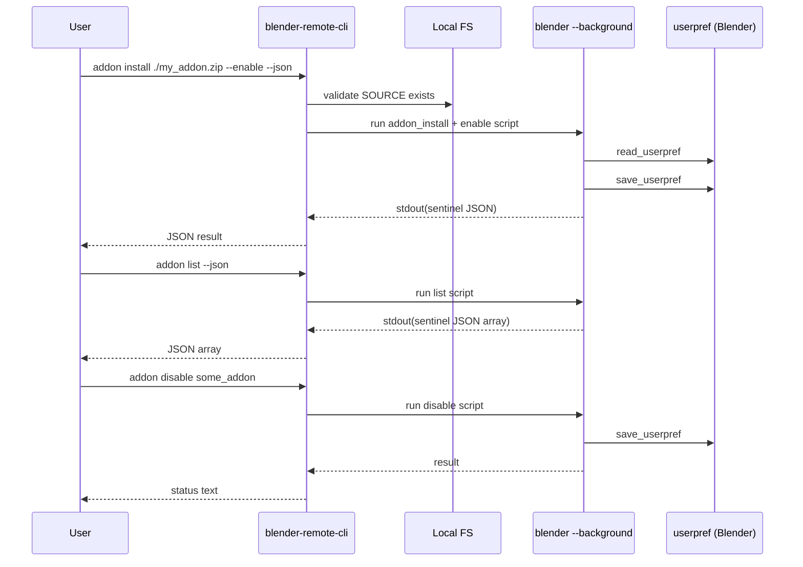

# Plan: Implement `blender-remote-cli addon ...` (Local User Add-on Management)

## HEADER
- **Purpose**: Add a new `blender-remote-cli addon ...` command group to install/list/enable/disable/uninstall Blender **user add-ons** for a **local** Blender installation, using filesystem operations plus one-shot `<blender> --background` runs to persist preferences.
- **Status**: Draft
- **Date**: 2025-12-18
- **Dependencies**:
  - `context/design/addon-management.md`
  - `tmp/blender-addon-mgr.py` (reference behavior + ops coverage)
  - `magic-context/general/python-coding-guide.md` (implementation conventions)
  - `src/blender_remote/cli/pkg/blender_background.py` (Blender background runner + JSON sentinels)
  - `src/blender_remote/cli/config.py` (config access)
  - `src/blender_remote/cli/app.py` (CLI command registration)
  - Manual test target: `extern/blender-win64/blender-5.0.0-windows-x64`
  - Docs target: `docs/manual/cli-tool.md`
- **Target**: blender-remote maintainers and AI coding assistants implementing CLI features.

---

## 1. Purpose and Outcome

Success looks like:

- A new top-level CLI group: `blender-remote-cli addon ...`.
- Implemented subcommands for **local** Blender add-on management:
  - `addon list` (user add-ons by default; optional `--all`).
  - `addon info <ADDON_NAME>`.
  - `addon install <SOURCE> [--enable] [--overwrite/--no-overwrite]`.
  - `addon enable <ADDON_NAME>` / `addon disable <ADDON_NAME>`.
  - `addon uninstall <ADDON_NAME> [--force]` with safety rules (user-only by default).
  - Optional nicety: `addon paths`.
- A predictable automation contract:
  - `--json` outputs exactly one JSON value to stdout (object/array), robust to Blender log noise.
  - Non-`--json` output is human-readable.
- Cross-platform behavior via Blender probes (no hardcoded path assumptions):
  - User add-ons directory resolved via Blender (`bpy.utils.user_resource('SCRIPTS', path='addons', create=True)`).
- Testing:
  - Unit tests mock Blender execution (no dependency on a real Blender binary).
  - A documented manual smoke test using the bundled Windows portable Blender.

Scope assumptions (to keep v1 deliverable):
- Manage “classic add-ons” (`addon_utils`, `bpy.ops.preferences.addon_install`) and the user add-ons directory; do not manage Blender “Extensions”.

## 2. Implementation Approach

### 2.1 High-level flow

1. **Add `addon` command group wiring**
   - Create `src/blender_remote/cli/commands/addon.py` and register it in `src/blender_remote/cli/app.py`.

2. **Generalize Blender JSON extraction to support arrays**
   - `src/blender_remote/cli/pkg/blender_background.py` currently extracts only JSON objects.
   - Add a new helper that extracts “JSON value” (object or array) between sentinels, and keep the object-only helper for callers that want stricter typing.

3. **Implement a small Blender “addon ops” script layer**
   - Create helper functions that generate Blender-run Python scripts for:
     - resolving the user add-ons directory and add-on search paths
     - listing add-ons (`addon_utils.modules()` + `addon_utils.check`)
     - retrieving info for one add-on
     - enable/disable (with `read_userpref` + `save_userpref`)
     - install (zip/py via `bpy.ops.preferences.addon_install`, directory via filesystem copy into user add-ons dir)
     - uninstall (disable first, then remove files; enforce user-only by default)
   - Scripts must:
     - print JSON between sentinels
     - minimize log noise (`--quiet`)
     - avoid `--factory-startup` by default (so user preferences are respected)

4. **Implement CLI command functions**
   - Each CLI subcommand:
     - resolves Blender executable from config (`blender.exec_path`)
     - invokes the appropriate helper (filesystem + Blender run)
     - prints human output or `--json` result
     - returns non-zero on error with clear Click exceptions

5. **Testing strategy**
   - Unit tests:
     - patch the Blender runner to return synthetic stdout with sentinel JSON
     - assert correct CLI behavior (args parsing, JSON output discipline, safety checks)
     - test path safety logic for uninstall (user-only vs `--force`)
   - Manual smoke tests (Windows portable Blender):
     - run commands against `extern/blender-win64/blender-5.0.0-windows-x64/blender.exe`
     - note: `--background` is synchronous; ensure scripts exit; if a run hangs, terminate Blender or run in a detached process for diagnosis.

### 2.2 Sequence diagram (steady-state usage)

## 3. Files to Modify or Add

- **`context/design/addon-management.md`**: update if implementation constraints require design adjustments (optional).
- **`context/plans/plan-addon-management-cli.md`**: this plan document (living doc).
- **`src/blender_remote/cli/app.py`**: register the new `addon` click group.
- **`src/blender_remote/cli/commands/addon.py`**: implement the click group and subcommands.
- **`src/blender_remote/cli/pkg/blender_background.py`**: add JSON “value” extraction (support arrays) and any needed flags (reuse `--quiet`, disable `--factory-startup` for addon ops).
- **`src/blender_remote/cli/addon_mgmt/`** (new package): helper functions for Blender scripts and filesystem operations (exact module naming TBD to avoid conflict with existing `src/blender_remote/cli/addon.py`).
- **`tests/test_cli_addon.py`**: unit tests for addon CLI behavior (mock Blender runner).
- **`docs/manual/cli-tool.md`**: add/extend documentation for `addon` usage and safety rules.
- **`CHANGELOG.md`**: document feature addition/scope.

## 4. TODOs (Implementation Steps)

- [ ] **Confirm CLI surface** Decide MVP subcommands (`list/info/install/enable/disable/uninstall[/paths]`) and whether `install` defaults to `--enable`.
- [ ] **Create command group** Add `src/blender_remote/cli/commands/addon.py` and wire it in `src/blender_remote/cli/app.py`.
- [ ] **Support JSON arrays** Extend `src/blender_remote/cli/pkg/blender_background.py` with sentinel extraction that can parse object or array payloads.
- [ ] **Add addon management helpers** Create a new helper package (e.g., `src/blender_remote/cli/addon_mgmt/`) with script builders and filesystem utilities.
- [ ] **Implement `addon paths` (optional)** Add a probe that returns user add-ons dir and search paths; use it internally for validation and as a user command.
- [ ] **Implement `addon list`** Blender-run script uses `addon_utils.modules()` and emits JSON array; support `--all` vs user-only.
- [ ] **Implement `addon info`** Blender-run script returns a JSON object for one add-on and supports “not found” signaling.
- [ ] **Implement `addon enable/disable`** Blender-run script updates state and persists preferences; make idempotent.
- [ ] **Implement `addon install`** Support directory/zip/py sources; determine module name deterministically when possible; enable optionally.
- [ ] **Implement `addon uninstall`** Disable first (best-effort), then remove files; enforce user-only path safety with `--force` override.
- [ ] **Add unit tests** Create `tests/test_cli_addon.py` covering argument parsing, JSON output discipline, and uninstall safety rules; mock Blender runner outputs.
- [ ] **Update docs** Add `addon` section and examples to `docs/manual/cli-tool.md`.
- [ ] **Manual smoke test** Use `extern/blender-win64/blender-5.0.0-windows-x64` and validate install/enable/list/disable/uninstall on a test add-on (ensure Blender exits; if it blocks/hangs, run in a detached process for debugging).

