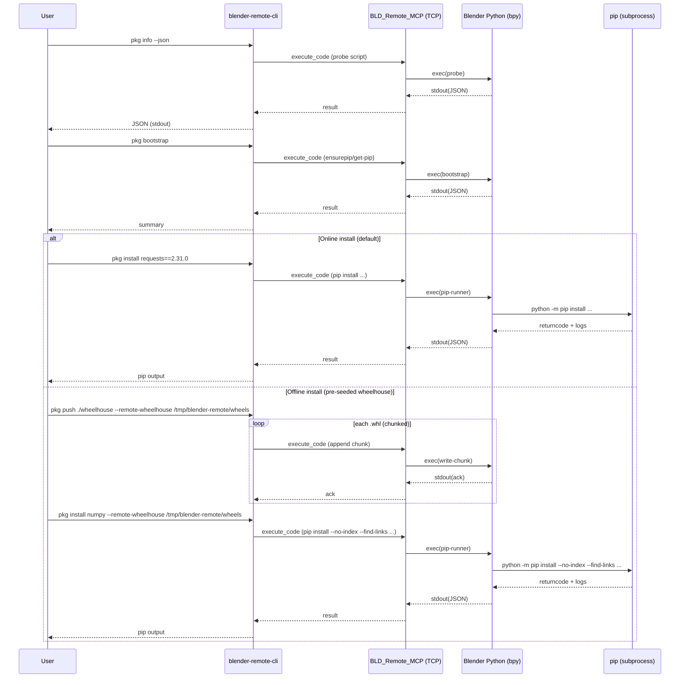

# Plan: Implement `blender-remote-cli pkg ...` (Remote Package Installation)

## HEADER
- **Purpose**: Implement the `blender-remote-cli pkg ...` command group for installing Python packages into the remote Blender Python environment, supporting both online and offline (wheelhouse) workflows via RPC.
- **Status**: Draft
- **Date**: 2025-12-17
- **Dependencies**:
  - `context/design/remote-package-installation.md`
  - `context/hints/howto-install-packages-on-offline-remote-python-via-rpc.md`
  - `src/blender_remote/cli/app.py`
  - `src/blender_remote/cli/transport.py`
  - `src/blender_remote/cli/commands/execute.py` (reference for base64 + execute_code usage)
  - `src/blender_remote/addon/bld_remote_mcp/__init__.py` (execute_code handler + command timeouts)
  - `docs/manual/cli-tool.md`
  - Test target: `extern/blender-win64/blender-5.0.0-windows-x64`
- **Target**: blender-remote maintainers and AI coding assistants implementing CLI + addon changes.

---

## 1. Purpose and Outcome

Success looks like:

- A new top-level CLI group: `blender-remote-cli pkg ...`.
- Implemented subcommands:
  - `pkg info` (+ `--json` for machine-readable output).
  - `pkg bootstrap` (ensure `pip` exists remotely).
  - `pkg install` (simple convenience wrapper: online by default, offline when `--remote-wheelhouse` is provided).
  - `pkg push` (upload wheels into a remote wheelhouse cache, chunked).
  - `pkg purge-cache` (delete everything inside the remote wheelhouse cache).
  - `pkg pip` (escape hatch: run arbitrary pip commands remotely).
- A predictable contract: packages are installed into the remote Blender Python **site-packages** (pip defaults), not alternate targets.
- A documented offline workflow: `pkg info --json` → controller downloads wheels → `pkg push` → `pkg install --remote-wheelhouse ...`.
- Practical timeouts for `pip` operations (which can exceed current 30s command execution limits).

## 2. Implementation Approach

### 2.1 High-level flow

1. **Add `pkg` command group wiring**
   - Create a new click group `pkg` and register it from `src/blender_remote/cli/app.py`.

2. **Add a small “remote exec” helper layer**
   - Centralize: port resolution (CLI option → config → default), execute_code invocation, base64 toggles, error handling, and parsing of structured stdout (JSON).
   - Prefer: remote scripts print exactly one JSON object to stdout for the CLI to parse, so CLI output can remain stable and scriptable.

3. **Implement `pkg info`**
   - Execute a remote probe script that gathers:
     - Blender/Python version, platform/arch, `sys.executable`, `bpy.app.python_args`.
     - Site-packages paths and writability.
     - `pip` availability/version (best-effort).
     - `bpy.app.online_access` (if present) plus an optional network probe result.
     - Recommended `pip download` flags for offline staging (best-effort; include a “tags” hint when feasible).
   - For `--json`, print a single JSON object to stdout and send any diagnostics to stderr.

4. **Implement remote “pip runner” primitive**
   - Remote code uses `subprocess.run([sys.executable, *bpy.app.python_args, "-m", "pip", ...], capture_output=True, text=True)` and returns a JSON summary (return code + truncated stdout/stderr to avoid the 10MB response cap).
   - This primitive underpins: `pkg bootstrap`, `pkg install`, and `pkg pip`.

5. **Implement `pkg bootstrap`**
   - Check `python -m pip --version`.
   - If missing:
     - Try `python -m ensurepip --upgrade`.
     - If ensurepip fails, run `get-pip.py`:
       - If controller has internet, download `get-pip.py` (to a temp file) and transfer to remote.
       - Else require `--get-pip PATH`.
   - Optionally `--upgrade` runs `pip install --upgrade pip` (best-effort; expect failure when remote is offline).

6. **Implement `pkg install`**
   - Validate package specs are “simple” (name + optional PEP 440 constraints); direct users to `pkg pip` for advanced cases.
   - Online (default): `pip install ... PACKAGE_SPEC...`.
   - Offline (`--remote-wheelhouse PATH`): `pip install --no-index --find-links <PATH> ... PACKAGE_SPEC...`.

7. **Implement `pkg push` (wheel transfer)**
   - Expand arguments into a list of `.whl` files (directories → `rglob("*.whl")`, plus direct `.whl` paths).
   - For each wheel:
     - Validate filename safety (no separators, no `..`).
     - Upload in chunks (default 5 MiB pre-base64) using repeated `execute_code` calls that append decoded bytes to a temp file, then rename to the final filename.
     - Optional verification: compare file size (and optionally sha256) after upload.
   - Ensure the remote wheelhouse exists (`mkdir -p` equivalent) before writing.

8. **Implement `pkg purge-cache`**
   - Remote code deletes all files and directories *inside* the remote wheelhouse directory (does not uninstall packages).
   - Support a local confirmation prompt unless `--yes` is provided.

9. **Timeout strategy (required for real-world pip operations)**
   - Add a per-command timeout override in the addon server loop so `execute_code` can run longer for pip installs/uploads.
   - Increase CLI socket timeout for `pkg` operations (connect/send/receive) to match.
   - Keep conservative defaults for existing non-`pkg` commands.

### 2.2 Sequence diagram (steady-state usage)

### 2.3 Manual testing strategy (Windows, real Blender)

Use the bundled Blender at `extern/blender-win64/blender-5.0.0-windows-x64` as the integration target.

Key points:
- First **install the `bld_remote_mcp` addon into that Blender** (so the TCP service exists).
- Prefer running Blender with `--background` (headless) for repeatable testing.
- Be careful with process control: `blender-remote-cli start --background` uses a keep-alive loop to keep Blender alive, so it will **block the terminal** that launched it. Run it in a separate terminal (or as a detached process) so you can run `pkg ...` commands concurrently (e.g., one terminal runs `start`, a second terminal runs `pkg ...`).

## 3. Files to Modify or Add

- **`src/blender_remote/cli/app.py`**: register the new `pkg` click group.
- **`src/blender_remote/cli/commands/pkg.py`** (new): implement `pkg` group + subcommands and CLI option parsing.
- **`src/blender_remote/cli/pkg/`** (new package): helpers for remote script generation, JSON parsing, wheel discovery, filename validation, and chunked uploads.
- **`src/blender_remote/addon/bld_remote_mcp/__init__.py`**: allow per-command timeout overrides to support long-running `pip` operations and large uploads.
- **`docs/manual/cli-tool.md`**: document `pkg` commands and online/offline workflows.
- **`tests/`** (new tests): add unit tests for CLI argument handling, JSON output guarantees, and helper utilities (mock transport; no Blender dependency).

## 4. TODOs (Implementation Steps)

- [ ] **Add `pkg` command group** Create `src/blender_remote/cli/commands/pkg.py`, add it to `src/blender_remote/cli/app.py`.
- [ ] **Implement port resolution helper** Reuse existing config/default behavior consistently across `pkg` subcommands.
- [ ] **Implement remote exec helper** Centralize `execute_code` calls, base64 toggles, and JSON parsing from captured stdout.
- [ ] **Implement `pkg info`** Add remote probe script + `--json` output that emits a single valid JSON object on stdout.
- [ ] **Implement pip runner remote script** Add a remote helper that executes `python -m pip ...` using `sys.executable` + `bpy.app.python_args` and returns structured JSON with truncated output.
- [ ] **Implement `pkg bootstrap`** Add ensurepip flow + get-pip download/transfer fallback (`--method`, `--get-pip`, `--upgrade`).
- [ ] **Implement `pkg install`** Add wrapper logic for online installs and offline installs triggered by `--remote-wheelhouse`.
- [ ] **Implement `pkg pip`** Add escape hatch that forwards args after `--` to the remote pip runner.
- [ ] **Implement `pkg push`** Add wheel discovery, safe filename handling, chunked base64 upload, and (optional) post-upload verification.
- [ ] **Implement `pkg purge-cache`** Add remote wheelhouse deletion with confirmation (`--yes`).
- [ ] **Increase/override timeouts** Extend addon to accept a per-command timeout override and update CLI calls to use longer socket timeouts for `pkg` operations.
- [ ] **Add unit tests** Cover: wheel discovery, filename validation, pip command construction (online/offline), and `pkg info --json` output discipline.
- [ ] **Manual smoke test (Windows)** Install the addon into `extern/blender-win64/blender-5.0.0-windows-x64` first, then validate manipulating that Blender Python env:
  - Configure repo CLI to use this Blender: `blender-remote-cli init extern/blender-win64/blender-5.0.0-windows-x64/blender.exe` (or update config to point at that path).
  - Install addon into that Blender: `blender-remote-cli install`.
  - Start the service in background mode (run in a separate terminal so it doesn’t block): `blender-remote-cli start --background`.
  - In another terminal, run and verify: `pkg info --json`, `pkg bootstrap`, online `pkg install <pkg>`, offline `pkg push` + `pkg install --remote-wheelhouse ...`, and `pkg purge-cache`.
  - Verify imports after install (example): `blender-remote-cli execute --code "import numpy; print(numpy.__version__)"`.
- [ ] **Update docs** Add `pkg` section + examples to `docs/manual/cli-tool.md`.
