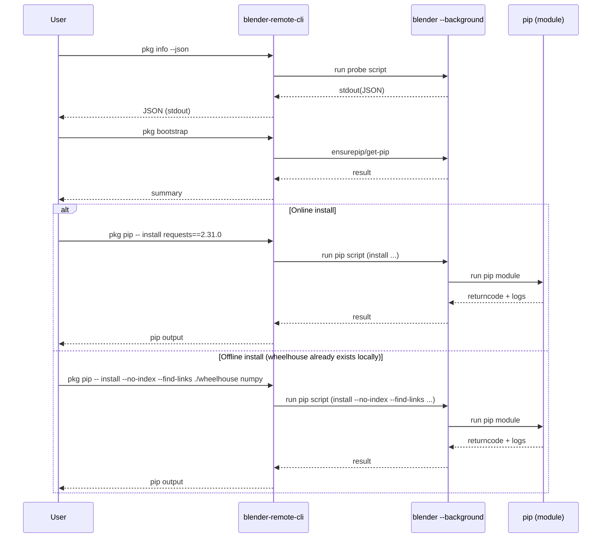

# Plan: Implement `blender-remote-cli pkg ...` (Local Blender Python `pip` Management)

## HEADER
- **Purpose**: Implement the `blender-remote-cli pkg ...` command group for managing Python packages in a local Blender installation by running `<blender> --background` scripts to execute `pip` inside Blender’s embedded Python (no direct python.exe reliance, no MCP/RPC, no remote file management).
- **Status**: Draft
- **Date**: 2025-12-17
- **Dependencies**:
  - `context/design/remote-package-installation.md`
  - `src/blender_remote/cli/app.py`
  - `src/blender_remote/cli/config.py` (timeouts + config access)
  - `src/blender_remote/cli/detection.py` (Blender installation discovery)
  - `docs/manual/cli-tool.md`
  - Test target: `extern/blender-win64/blender-5.0.0-windows-x64`
- **Target**: blender-remote maintainers and AI coding assistants implementing CLI changes.

---

## 1. Purpose and Outcome

Success looks like:

- A new top-level CLI group: `blender-remote-cli pkg ...`.
- Implemented subcommands:
  - `pkg info` (+ `--json` for machine-readable output).
  - `pkg bootstrap` (ensure `pip` exists for Blender Python via Blender background runs).
  - `pkg pip` (escape hatch: run arbitrary pip commands via Blender background runs).
- A predictable contract: packages are installed into Blender Python **site-packages** (pip defaults), not alternate targets.
- A documented offline workflow: `pkg info --json` → prepare wheels elsewhere → copy wheelhouse onto the offline host → `pkg pip -- install --no-index --find-links <PATH> ...`.
- Practical timeouts for `pip` operations (which can exceed default CLI command timeouts).

## 2. Implementation Approach

### 2.1 High-level flow

1. **Add `pkg` command group wiring**
   - Create a new click group `pkg` and register it from `src/blender_remote/cli/app.py`.

2. **Add a small “Blender background runner” helper layer**
   - Centralize: resolve Blender executable path (CLI option → config), generate temp scripts, invoke `<blender> --background --python <script.py> -- ...`, error handling, and structured output parsing (JSON).
   - Prefer: scripts print a single JSON object wrapped in sentinel markers so the CLI can extract it even if Blender emits extra logs.

3. **Implement `pkg info`**
   - Execute a local probe script via Blender background mode that gathers:
     - Blender/Python version, platform/arch.
     - Site-packages paths and writability.
     - `pip` availability/version (best-effort).
     - Recommended `pip download` flags for offline staging (best-effort; include a “tags” hint when feasible).
   - For `--json`, print a single JSON object to stdout and send any diagnostics to stderr.

4. **Implement “pip runner” primitive**
   - CLI invokes Blender in background mode with a script that runs the equivalent of `python -m pip ...` inside Blender’s embedded Python, and returns a structured summary (return code + captured output).
   - This primitive underpins: `pkg bootstrap` and `pkg pip`.

5. **Implement `pkg bootstrap`**
   - Check pip usability by running a Blender background script (pip `--version` equivalent).
   - If missing:
     - Try ensurepip (within Blender’s embedded Python).
     - If ensurepip fails, run `get-pip.py`:
       - Require the user to provide a local `get-pip.py` path (e.g. `--get-pip ./get-pip.py`).
   - Optionally `--upgrade` runs `pip install --upgrade pip` (best-effort; expect failure when the host is offline).

6. **Implement `pkg pip`**
   - Provide an explicit `--` separator and forward all remaining args to the Blender background pip runner.
   - Offline installs are handled by user-provided pip flags and locally staged files (e.g. `--no-index --find-links ./wheelhouse`).

7. **Timeout strategy (required for real-world pip operations)**
   - Use `cli.timeout_sec` as the default subprocess timeout for `pkg` operations.
   - Keep conservative defaults for existing non-`pkg` commands.

### 2.2 Sequence diagram (steady-state usage)

### 2.3 Manual testing strategy (Windows, real Blender)

Use the bundled Blender at `extern/blender-win64/blender-5.0.0-windows-x64` as the integration target.

Key points:
- `pkg` commands only require the Blender installation path; the CLI launches Blender in background mode as needed.
- Be mindful that installing packages while Blender is running may require restarting Blender to pick up changes.

## 3. Files to Modify or Add

- **`src/blender_remote/cli/app.py`**: register the new `pkg` click group.
- **`src/blender_remote/cli/commands/pkg.py`** (new): implement `pkg` group + subcommands and CLI option parsing.
- **`src/blender_remote/cli/pkg/`** (new package): helpers for script generation, JSON parsing, Blender background invocation, and pip runner invocation.
- **`docs/manual/cli-tool.md`**: document `pkg` commands and online/offline workflows.
- **`tests/`** (new tests): add unit tests for CLI argument handling, JSON output guarantees, and helper utilities (mock subprocess; no Blender dependency).

## 4. TODOs (Implementation Steps)

- [ ] **Add `pkg` command group** Create `src/blender_remote/cli/commands/pkg.py`, add it to `src/blender_remote/cli/app.py`.
- [ ] **Implement Blender background runner helper** Run `<blender> --background --python <script.py> -- ...` with good error reporting.
- [ ] **Implement `pkg info`** Add local probe script + `--json` output that emits a single valid JSON object on stdout.
- [ ] **Implement pip runner** Run `pip` inside Blender’s embedded Python (via Blender background scripts) with a configurable timeout and good error reporting.
- [ ] **Implement `pkg bootstrap`** Add ensurepip flow + local get-pip runner (`--method`, `--get-pip`, `--upgrade`).
- [ ] **Implement `pkg pip`** Add escape hatch that forwards args after `--` to the pip runner.
- [ ] **Use CLI timeouts** Use `cli.timeout_sec` for `pkg` operations.
- [ ] **Add unit tests** Cover: pip command forwarding (online/offline flags), blender background invocation, and `pkg info --json` output discipline.
- [ ] **Manual smoke test (Windows)** Use `extern/blender-win64/blender-5.0.0-windows-x64` and validate manipulating that Blender Python env:
  - Configure repo CLI to use this Blender: `blender-remote-cli init extern/blender-win64/blender-5.0.0-windows-x64/blender.exe` (or update config to point at that path).
  - In another terminal, run and verify: `pkg info --json`, `pkg bootstrap`, and `pkg pip -- install ...` (online), plus `pkg pip -- install --no-index --find-links ./wheelhouse ...` (offline with local wheelhouse).
  - Verify install (example): `blender-remote-cli pkg pip -- show numpy` or `blender-remote-cli pkg pip -- list`.
- [ ] **Update docs** Add `pkg` section + examples to `docs/manual/cli-tool.md`.
