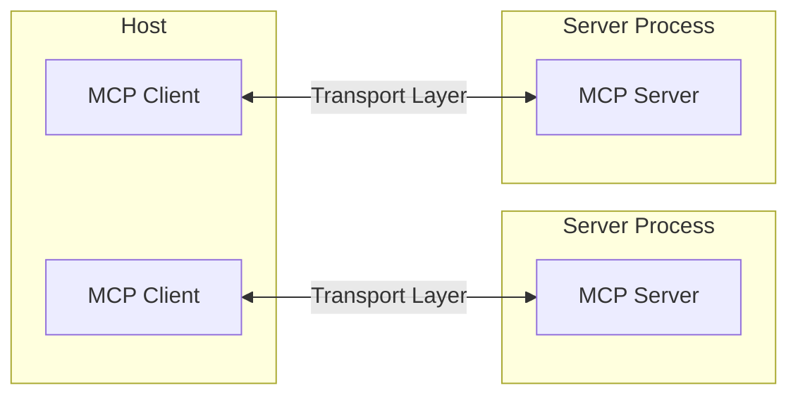

# Model Context Protocol (MCP)

The Model Context Protocol (MCP) provides a standardized way for applications to share contextual information with language models, expose tools and capabilities to AI systems, and build composable integrations and workflows.

The protocol uses JSON-RPC 2.0 messages to establish communication between:
- **Hosts**: LLM applications that initiate connections
- **Clients**: Connectors within the host application
- **Servers**: Services that provide context and capabilities

## Key Interactions

- **Client/Server Initialization**: Transport setup, protocol compatibility check, capability negotiation, and implementation details exchange.
- **Message Flow**: JSON-RPC message handling, validation, type-safe response processing, and error handling.
- **Resource Management**: Resource discovery, URI template-based access, subscription system, and content retrieval.

## Client-Server Architecture

MCP follows a client-server architecture where multiple clients within a host can connect to server processes via a transport layer.



## Message Types

MCP defines three fundamental message types based on JSON-RPC 2.0:

- **Requests**: Messages sent to initiate an operation. Must include a unique ID and method name.
- **Responses**: Messages sent in reply to requests. Must include the same ID as the request.
- **Notifications**: One-way messages with no reply. Must not include an ID.

## Authorization

MCP provides an optional transport-level authorization for clients to make requests to restricted servers. For HTTP-based transports, it's recommended to conform to the specification, while for STDIO, credentials should be retrieved from the environment.

## Server Capabilities

A custom MCP server can expose a variety of capabilities to a client. These are negotiated during the initialization phase. Key server capabilities include:

- **prompts**: Offer prompt templates to the client.
- **resources**: Provide readable resources (e.g., files, data).
- **tools**: Expose callable tools for the AI model to execute.
- **logging**: Emit structured log messages.
- **completions**: Support argument autocompletion.

### Message Structures

Here are the basic structures for the JSON-RPC 2.0 messages.

#### Request
```typescript
{
  "jsonrpc": "2.0",
  "id": "string" | "number",
  "method": "string",
  "params"?: {
    [key: string]: unknown
  }
}
```

#### Response
```typescript
{
  "jsonrpc": "2.0",
  "id": "string" | "number",
  "result"?: {
    [key: string]: unknown
  },
  "error"?: {
    "code": "number",
    "message": "string",
    "data"?: unknown
  }
}
```

#### Notification
```typescript
{
  "jsonrpc": "2.0",
  "method": "string",
  "params"?: {
    [key: string]: unknown
  }
}
```

### Tool Definition

When exposing tools, they should follow this structure:

```typescript
{
  "name": "string", // Unique identifier for the tool
  "title": "string", // Optional human-readable name
  "description": "string", // Human-readable description of functionality
  "inputSchema": {}, // JSON Schema defining expected parameters
  "outputSchema": {}, // Optional JSON Schema defining expected output
  "annotations": {} // Optional properties describing tool behavior
}
```

### Implementation Best Practices

When creating a server, consider the following:

1.  **Validate Inputs**: Servers SHOULD validate arguments from clients before processing.
2.  **Handle Large Lists**: Clients SHOULD handle pagination for large lists of resources, but servers must be prepared to send them.
3.  **Respect Capabilities**: Both parties MUST respect the capability negotiation that occurs during initialization.
