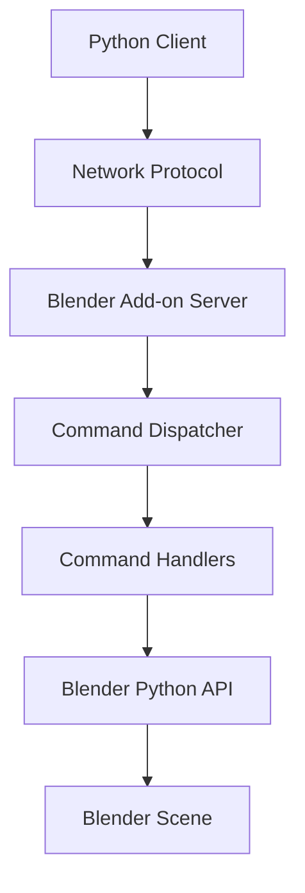

# Development Guide

Contributing to Blender Remote and extending its functionality.

## Development Setup

### Prerequisites

- **Python 3.8+**: Required for development
- **Blender 3.0+**: For testing add-on functionality
- **Git**: Version control
- **Pixi**: Package management (recommended)

### Environment Setup

#### Option 1: Using Pixi (Recommended)

```bash
# Clone the repository
git clone https://github.com/igamenovoer/blender-remote.git
cd blender-remote

# Install pixi if not already installed
curl -fsSL https://pixi.sh/install.sh | bash

# Set up development environment
pixi install

# Activate the environment
pixi shell
```

#### Option 2: Using pip

```bash
# Clone the repository
git clone https://github.com/igamenovoer/blender-remote.git
cd blender-remote

# Create virtual environment
python -m venv venv
source venv/bin/activate  # On Windows: venv\Scripts\activate

# Install development dependencies
pip install -e ".[dev]"
```

### Development Commands

```bash
# Run tests
pixi run test

# Run tests with coverage
pixi run test-cov

# Lint code
pixi run lint

# Format code
pixi run format

# Type checking
pixi run typecheck

# Build package
pixi run build

# Clean build artifacts
pixi run clean
```

## Project Structure

### Source Layout

```
blender-remote/
├── src/
│   └── blender_remote/          # Main Python package
│       ├── __init__.py          # Package initialization
│       ├── client.py            # Client connection logic
│       ├── commands.py          # Command definitions
│       ├── protocol.py          # Communication protocol
│       └── utils.py             # Utility functions
├── blender_addon/               # Blender add-on
│   ├── __init__.py              # Add-on registration
│   ├── server.py                # Server implementation
│   ├── commands/                # Command handlers
│   └── ui/                      # User interface
├── scripts/                     # CLI tools
│   ├── __init__.py
│   └── cli.py                   # Main CLI implementation
├── tests/                       # Test suite
│   ├── unit/                    # Unit tests
│   ├── integration/             # Integration tests
│   └── conftest.py              # Test configuration
├── docs/                        # Documentation
└── context/                     # AI assistant resources
```

### Key Components

#### Core Library (`src/blender_remote/`)

- **client.py**: Client-side connection and communication
- **commands.py**: Command definitions and validation
- **protocol.py**: Network protocol implementation
- **utils.py**: Shared utilities and helpers

#### Blender Add-on (`blender_addon/`)

- **server.py**: Server-side communication handler
- **commands/**: Individual command implementations
- **ui/**: Blender UI panels and preferences

#### CLI Tools (`scripts/`)

- **cli.py**: Command-line interface implementation

## Development Workflow

### 1. Setting Up Your Branch

```bash
# Create feature branch
git checkout -b feature/your-feature-name

# Make your changes
# ...

# Run tests and linting
pixi run test
pixi run lint
pixi run format
```

### 2. Development Testing

#### Unit Tests

```bash
# Run all unit tests
pixi run test

# Run specific test file
pytest tests/unit/test_client.py

# Run with coverage
pixi run test-cov
```

#### Integration Tests

```bash
# Start Blender with test add-on
blender --background --python tests/setup_test_server.py &

# Run integration tests
pytest tests/integration/

# Clean up
pkill blender
```

#### Manual Testing

```bash
# Install package in development mode
pixi run dev

# Test CLI
blender-remote --help

# Test Python API
python -c "import blender_remote; print('OK')"
```

### 3. Code Quality

#### Linting

```bash
# Check code style
pixi run lint

# Fix auto-fixable issues
ruff check --fix .
```

#### Formatting

```bash
# Format code
pixi run format

# Check formatting
black --check .
```

#### Type Checking

```bash
# Run type checker
pixi run typecheck

# Check specific file
mypy src/blender_remote/client.py
```

### 4. Documentation

Update documentation when making changes:

```bash
# Build documentation locally
pixi run docs

# Serve documentation
pixi run docs-serve

# Open http://localhost:8000
```

## Adding New Features

### 1. Adding a New Command

#### Step 1: Define Command Schema

In `src/blender_remote/commands.py`:

```python
from typing import Dict, Any, Optional
from pydantic import BaseModel

class CreateCustomObjectParams(BaseModel):
    object_type: str
    location: tuple[float, float, float] = (0, 0, 0)
    scale: tuple[float, float, float] = (1, 1, 1)
    custom_property: Optional[str] = None

COMMAND_SCHEMAS = {
    # ... existing commands
    "create_custom_object": CreateCustomObjectParams,
}
```

#### Step 2: Implement Client Method

In `src/blender_remote/client.py`:

```python
class BlenderConnection:
    # ... existing methods
    
    def create_custom_object(
        self,
        object_type: str,
        location: tuple[float, float, float] = (0, 0, 0),
        scale: tuple[float, float, float] = (1, 1, 1),
        custom_property: Optional[str] = None
    ):
        """Create a custom object in Blender.
        
        Args:
            object_type: Type of object to create
            location: Object position (x, y, z)
            scale: Object scale (x, y, z)
            custom_property: Optional custom property
            
        Returns:
            Object reference
        """
        params = {
            "object_type": object_type,
            "location": location,
            "scale": scale,
        }
        if custom_property is not None:
            params["custom_property"] = custom_property
            
        return self._send_command("create_custom_object", params)
```

#### Step 3: Implement Server Handler

In `blender_addon/commands/object_commands.py`:

```python
import bpy
from typing import Dict, Any

def create_custom_object(params: Dict[str, Any]) -> Dict[str, Any]:
    """Server-side implementation of create_custom_object command."""
    try:
        object_type = params["object_type"]
        location = params["location"]
        scale = params["scale"]
        custom_property = params.get("custom_property")
        
        # Create object based on type
        if object_type == "my_custom_type":
            # Your custom object creation logic
            bpy.ops.mesh.primitive_cube_add(location=location)
            obj = bpy.context.active_object
            obj.scale = scale
            
            if custom_property:
                obj["custom_property"] = custom_property
            
            return {
                "success": True,
                "result": {
                    "object_id": obj.name,
                    "location": list(obj.location),
                    "scale": list(obj.scale)
                }
            }
        else:
            raise ValueError(f"Unknown object type: {object_type}")
            
    except Exception as e:
        return {
            "success": False,
            "error": {
                "code": "CREATION_FAILED",
                "message": str(e)
            }
        }
```

#### Step 4: Register Command

In `blender_addon/__init__.py`:

```python
from .commands.object_commands import create_custom_object

COMMAND_REGISTRY = {
    # ... existing commands
    "create_custom_object": create_custom_object,
}
```

#### Step 5: Add Tests

In `tests/unit/test_commands.py`:

```python
def test_create_custom_object_validation():
    """Test command parameter validation."""
    from blender_remote.commands import CreateCustomObjectParams
    
    # Valid parameters
    params = CreateCustomObjectParams(
        object_type="my_custom_type",
        location=(1, 2, 3),
        scale=(2, 2, 2)
    )
    assert params.object_type == "my_custom_type"
    assert params.location == (1, 2, 3)

def test_create_custom_object_client():
    """Test client method."""
    # Mock client test
    pass
```

In `tests/integration/test_object_creation.py`:

```python
def test_create_custom_object_integration(blender_client):
    """Test full command execution."""
    result = blender_client.create_custom_object(
        object_type="my_custom_type",
        location=(1, 2, 3),
        custom_property="test_value"
    )
    
    assert result["success"] is True
    assert "object_id" in result["result"]
```

### 2. Adding CLI Commands

#### Add to CLI

In `scripts/cli.py`:

```python
@cli.command()
@click.argument('object_type')
@click.option('--location', nargs=3, type=float, default=(0, 0, 0))
@click.option('--scale', nargs=3, type=float, default=(1, 1, 1))
@click.option('--custom-property', help='Custom property value')
def create_custom(object_type, location, scale, custom_property):
    """Create a custom object."""
    client = get_client()
    
    try:
        result = client.create_custom_object(
            object_type=object_type,
            location=location,
            scale=scale,
            custom_property=custom_property
        )
        click.echo(f"Created object: {result['result']['object_id']}")
    except Exception as e:
        click.echo(f"Error: {e}", err=True)
        raise click.Abort()
```

## Testing

### Test Structure

```
tests/
├── unit/                        # Unit tests
│   ├── test_client.py           # Client logic tests
│   ├── test_commands.py         # Command validation tests
│   └── test_protocol.py         # Protocol tests
├── integration/                 # Integration tests
│   ├── test_full_workflow.py    # End-to-end tests
│   └── test_blender_addon.py    # Add-on integration tests
├── fixtures/                    # Test data
│   ├── test_scenes/             # Blender test files
│   └── sample_data/             # Sample input data
└── conftest.py                  # Pytest configuration
```

### Writing Tests

#### Unit Test Example

```python
# tests/unit/test_client.py
import pytest
from unittest.mock import Mock, patch
from blender_remote.client import BlenderConnection

class TestBlenderConnection:
    def test_connection_initialization(self):
        """Test client initialization."""
        client = BlenderConnection("localhost", 5555)
        assert client.host == "localhost"
        assert client.port == 5555
        assert not client.is_connected()

    @patch('blender_remote.client.socket')
    def test_connect_success(self, mock_socket):
        """Test successful connection."""
        mock_socket.create_connection.return_value = Mock()
        
        client = BlenderConnection("localhost", 5555)
        client.connect()
        
        assert client.is_connected()
        mock_socket.create_connection.assert_called_once()
```

#### Integration Test Example

```python
# tests/integration/test_full_workflow.py
import pytest
import blender_remote

@pytest.fixture
def blender_client():
    """Provide connected Blender client for tests."""
    client = blender_remote.connect("localhost", 5555)
    yield client
    client.disconnect()

def test_create_and_render_workflow(blender_client):
    """Test complete create-and-render workflow."""
    # Clear scene
    blender_client.clear_scene()
    
    # Create object
    cube = blender_client.create_primitive("cube", location=(0, 0, 1))
    assert cube is not None
    
    # Render scene
    output = blender_client.render("test_output.png")
    assert output.endswith("test_output.png")
```

### Test Configuration

#### pytest.ini

```ini
[tool:pytest]
testpaths = tests
python_files = test_*.py
python_classes = Test*
python_functions = test_*
addopts = 
    -v
    --strict-markers
    --tb=short
    --cov=src/blender_remote
    --cov=scripts
    --cov-report=html
    --cov-report=term-missing

markers =
    unit: Unit tests
    integration: Integration tests
    slow: Slow-running tests
    blender: Tests requiring Blender
```

#### conftest.py

```python
# tests/conftest.py
import pytest
import subprocess
import time
import blender_remote

@pytest.fixture(scope="session")
def blender_server():
    """Start Blender server for integration tests."""
    # Start Blender with test configuration
    process = subprocess.Popen([
        "blender",
        "--background",
        "--python", "tests/setup_test_server.py"
    ])
    
    # Wait for server to start
    time.sleep(5)
    
    yield "localhost:5555"
    
    # Clean up
    process.terminate()
    process.wait()

@pytest.fixture
def blender_client(blender_server):
    """Provide connected client for tests."""
    host, port = blender_server.split(":")
    client = blender_remote.connect(host, int(port))
    
    yield client
    
    client.disconnect()
```

## Documentation

### Writing Documentation

#### API Documentation

Use docstrings with Google/NumPy style:

```python
def create_primitive(
    self,
    primitive_type: str,
    location: tuple[float, float, float] = (0, 0, 0),
    rotation: tuple[float, float, float] = (0, 0, 0),
    scale: tuple[float, float, float] = (1, 1, 1)
) -> Dict[str, Any]:
    """Create a primitive object in Blender.
    
    Args:
        primitive_type: Type of primitive to create. Supported types:
            'cube', 'sphere', 'cylinder', 'cone', 'torus', 'plane'
        location: Object position as (x, y, z) coordinates.
        rotation: Object rotation as (x, y, z) angles in radians.
        scale: Object scale factors as (x, y, z) multipliers.
    
    Returns:
        Dictionary containing:
            - success (bool): Whether operation succeeded
            - result (dict): Object information if successful
            - error (dict): Error details if failed
    
    Raises:
        ConnectionError: If not connected to Blender
        BlenderError: If object creation fails
        ValueError: If primitive_type is invalid
    
    Example:
        >>> client = blender_remote.connect("localhost", 5555)
        >>> cube = client.create_primitive("cube", location=(0, 0, 1))
        >>> print(cube['result']['object_id'])
        'Cube'
    """
```

#### MkDocs Configuration

The project uses MkDocs Material. Update `mkdocs.yml` when adding new documentation:

```yaml
nav:
  - Home: index.md
  - Installation: installation.md
  - Getting Started: getting-started.md
  - API Reference: api-reference.md
  - CLI Tools: cli.md
  - Blender Add-on: blender-addon.md
  - Development: development.md
  - Your New Page: your-new-page.md
```

### Building Documentation

```bash
# Install documentation dependencies
pixi install

# Build documentation
pixi run docs

# Serve locally with live reload
pixi run docs-serve

# Open browser to http://localhost:8000
```

## Contributing Guidelines

### Code Style

- **Formatting**: Use Black for code formatting
- **Linting**: Follow Ruff recommendations
- **Type Hints**: Use type annotations for all public APIs
- **Docstrings**: Document all public functions and classes

### Commit Messages

Use conventional commit format:

```
type(scope): description

[optional body]

[optional footer]
```

Types: `feat`, `fix`, `docs`, `style`, `refactor`, `test`, `chore`

Examples:
```
feat(client): add support for custom object creation
fix(addon): resolve connection timeout issue
docs(api): update create_primitive documentation
test(integration): add end-to-end workflow tests
```

### Pull Request Process

1. **Fork and Branch**: Create feature branch from `main`
2. **Develop**: Make changes following code style guidelines
3. **Test**: Ensure all tests pass and add new tests for features
4. **Document**: Update documentation for API changes
5. **Commit**: Use conventional commit messages
6. **Pull Request**: Create PR with clear description

### Pull Request Template

```markdown
## Description
Brief description of changes

## Type of Change
- [ ] Bug fix
- [ ] New feature
- [ ] Breaking change
- [ ] Documentation update

## Testing
- [ ] Tests pass locally
- [ ] Added tests for new functionality
- [ ] Manual testing completed

## Documentation
- [ ] Updated API documentation
- [ ] Updated user documentation
- [ ] Added code comments where needed

## Checklist
- [ ] Code follows style guidelines
- [ ] Self-review completed
- [ ] No merge conflicts
```

## Release Process

### Version Management

The project uses semantic versioning (SemVer):
- **Major**: Breaking changes
- **Minor**: New features (backward compatible)
- **Patch**: Bug fixes

### Release Steps

1. **Update Version**:
   ```bash
   # Update version in relevant files
   sed -i 's/version = "0.1.0"/version = "0.2.0"/' pyproject.toml
   sed -i 's/__version__ = "0.1.0"/__version__ = "0.2.0"/' src/blender_remote/__init__.py
   ```

2. **Update Changelog**:
   ```bash
   # Add release notes to CHANGELOG.md
   ```

3. **Test Release**:
   ```bash
   pixi run test
   pixi run build
   ```

4. **Create Release**:
   ```bash
   git tag v0.2.0
   git push origin v0.2.0
   ```

5. **Publish to PyPI**:
   ```bash
   # Automated via GitHub Actions
   ```

## Troubleshooting Development Issues

### Common Problems

#### Import Errors
```python
# ModuleNotFoundError: No module named 'blender_remote'
# Solution: Install package in development mode
pip install -e .
```

#### Blender Connection Issues
```bash
# Connection refused during testing
# Solution: Ensure Blender test server is running
blender --background --python tests/setup_test_server.py &
```

#### Test Failures
```bash
# Tests fail due to missing dependencies
# Solution: Install test dependencies
pixi install
```

### Debug Tools

#### Logging Configuration

```python
import logging

# Enable debug logging
logging.basicConfig(level=logging.DEBUG)
logger = logging.getLogger('blender_remote')
logger.setLevel(logging.DEBUG)
```

#### Network Debugging

```bash
# Monitor network traffic
sudo tcpdump -i lo port 5555

# Test connection manually
telnet localhost 5555
```

#### Blender Console

Access Blender's Python console for server-side debugging:
```python
# In Blender's Python console
import blender_remote_addon
blender_remote_addon.get_server_status()
```

## Architecture and Design Patterns

### Communication Architecture



### Design Patterns Used

- **Command Pattern**: For operation encapsulation
- **Factory Pattern**: For object creation
- **Observer Pattern**: For event handling
- **Strategy Pattern**: For different render engines

### Extension Points

- **Custom Commands**: Add new operations
- **Protocol Extensions**: Enhance communication
- **UI Components**: Extend Blender interface
- **Export Formats**: Add new file formats

This development guide provides the foundation for contributing to Blender Remote. For specific questions or advanced topics, please refer to the project's issue tracker or community discussions.