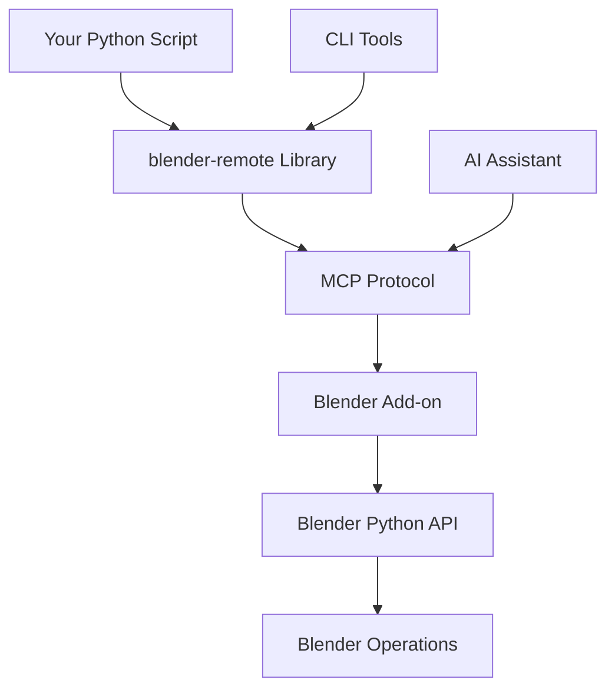

# Blender Remote

Welcome to **Blender Remote** - the ultimate solution for controlling Blender remotely through Python and MCP server integration.

{ align=right width=300 }

## What is Blender Remote?

Blender Remote enables you to control Blender from any Python environment, providing:

- **🔌 Remote Control**: Connect to Blender from external Python scripts
- **🤖 MCP Integration**: Model Context Protocol for AI-assisted workflows
- **⌨️ CLI Tools**: Command-line interface for quick operations
- **🔧 Extensible**: Easy to add custom commands and operations

## Quick Start

```python
import blender_remote

# Connect to Blender
client = blender_remote.connect("localhost", 5555)

# Create a cube
client.create_primitive("cube", location=(0, 0, 0))

# Render the scene
client.render("output.png")
```

## Key Features

### 🎯 Real-time Control
Send commands and receive responses instantly from your running Blender instance.

### 🐍 Python API
Full-featured Python library for complex automation and integration with existing workflows.

### 🖥️ CLI Tools
Quick command-line access to common Blender operations without writing code.

### 🔗 MCP Server
Built-in Model Context Protocol server for seamless AI assistant integration.

### 📦 Easy Installation
Available on PyPI with simple `pip install blender-remote`.

## Architecture Overview



## Use Cases

- **Automation**: Batch processing of 3D models and scenes
- **CI/CD**: Automated rendering in continuous integration pipelines
- **AI Workflows**: LLM-assisted 3D content creation and modification
- **Remote Rendering**: Control Blender instances on powerful remote machines
- **Integration**: Embed Blender operations in larger Python applications

## Getting Started

Ready to get started? Check out our comprehensive guides:

- [Installation](installation.md) - Set up Blender Remote in your environment
- [Getting Started](getting-started.md) - Your first remote Blender session
- [API Reference](api-reference.md) - Complete Python API documentation
- [CLI Tools](cli.md) - Command-line interface guide
- [Development](development.md) - Contributing and extending Blender Remote

## Community

- **GitHub**: [igamenovoer/blender-remote](https://github.com/igamenovoer/blender-remote)
- **Issues**: Report bugs and request features
- **Discussions**: Community support and ideas

---

**Get started today and unlock the power of remote Blender control!**